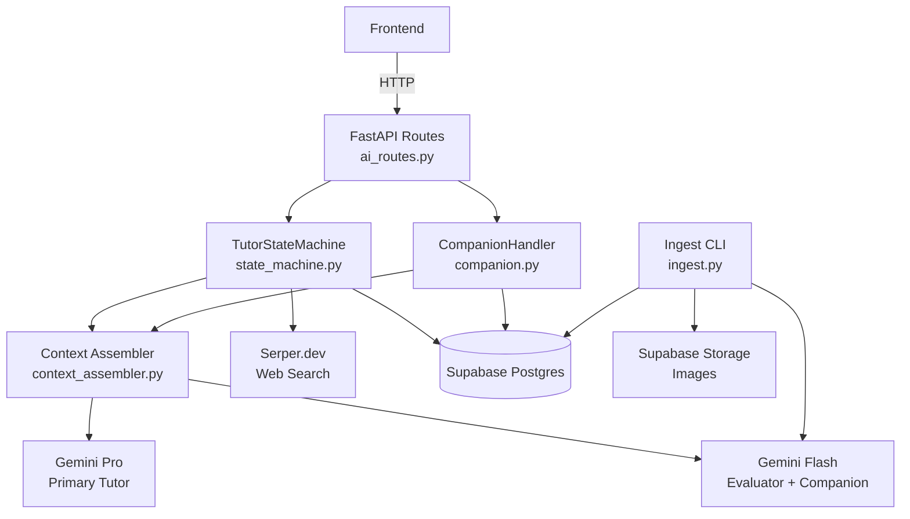

# AI Engine — Handover Document

> **Branch**: `feature/AI_Engine_tirth`  
> **Last updated**: 2 March 2026  
> **Stack**: Gemini Pro + Flash · Serper · Supabase · Local BGE embeddings

---

## Architecture Overview



---

## File-by-File Reference

### `ai_engine/schemas.py`
**Purpose**: All Pydantic models and enums for the AI engine.

| Item | Description |
|---|---|
| `TeachingState` | Enum with 10 states: `PREREQUISITE_CHECK`, `TEACH`, `CHECK_UNDERSTANDING`, `HINT`, `RETEACH_WITH_ANALOGY`, `DOUBT_RESPONSE`, `REMEDIATE`, `NODE_COMPLETE`, `CHAPTER_EVALUATION`, `CHAPTER_COMPLETE` |
| `StateMachineSnapshot` | Full in-memory state of the tutor: current state, node index, stack, prereq results, evaluator output |
| `RoadmapJSON` | Schema for parsed roadmap data: chapter name, prerequisites, and teaching nodes |
| `TeachingNode` | Individual teaching node: topic, core concept, check question, misconceptions |
| `EvaluatorOutput` | Output from the evaluator LLM: understanding level (high/medium/low), misconceptions |
| `QuestionBankItem` | Question schema: question text, type (MCQ/short/long), difficulty, model answer |
| `ContextExtractorOutput` | Structured context extracted from companion sessions: interests, learning style, confidence |
| Request/Response models | `CompanionTurnRequest`, `TutorStartSessionRequest`, `StudentProgressResponse`, etc. |

---

### `ai_engine/context_assembler.py`
**Purpose**: Builds system prompts for every LLM call. This is where you define *how* the AI behaves.

| Function | Model | Description |
|---|---|---|
| `assemble_tutor_context()` | Gemini Pro | 7-block system prompt: persona + student profile + roadmap + state instructions + content + extras |
| `assemble_evaluator_context()` | Gemini Flash | Evaluates student understanding → outputs JSON with `high/medium/low` |
| `assemble_analogy_context()` | Gemini Flash | Generates interest-based analogies (e.g., cricket → chemical reactions) |
| `assemble_companion_context()` | Gemini Flash | Companion persona with onboarding vs returning-student modes |
| `assemble_context_extractor_context()` | Gemini Flash | Extracts structured data (interests, anxiety, confidence) from companion conversations |
| `assemble_doubt_detector_context()` | Gemini Flash | Classifies if a student message is a "doubt" vs "response" |

**Key design**: State-specific instructions are appended to the system prompt based on the current `TeachingState`. Edit `_get_state_instructions()` to change teaching behavior per state.

---

### `ai_engine/state_machine.py`
**Purpose**: The brain of the AI tutor. Manages the full teaching flow.

**Core class**: `TutorStateMachine`

| Method | Description |
|---|---|
| `load_state(session_id)` | Loads chapter, roadmap, student profile, subject context, conversation history from DB |
| `save_state()` | Persists current snapshot and learning state to DB |
| `generate_opening()` | Creates the first message: prerequisite check or start teaching |
| `process_turn(message)` | Main loop: doubt detection → state routing → evaluator → transitions |
| `end_session(reason)` | Gracefully ends the session |

**State transition logic**:
```
PREREQUISITE_CHECK ──→ TEACH (if passed) or REMEDIATE (if weak)
TEACH ──→ CHECK_UNDERSTANDING
CHECK_UNDERSTANDING ──→ NODE_COMPLETE (high) / HINT (medium/low)
HINT ──→ NODE_COMPLETE (high) / RETEACH_WITH_ANALOGY (still struggling)
RETEACH_WITH_ANALOGY ──→ NODE_COMPLETE (flag if still struggling)
NODE_COMPLETE ──→ TEACH (next node) or CHAPTER_EVALUATION (all done)
CHAPTER_EVALUATION ──→ CHAPTER_COMPLETE (after ~5 eval turns)
DOUBT_RESPONSE ──→ (pushes/pops from any state)
```

**LLM calls inside**:
- `_call_gemini_pro()` — tutor responses (system + conversation history)
- `_call_gemini_flash()` — evaluator, doubt detector, analogy
- `_call_flash_json()` — evaluator output parsing
- `_web_search()` — Serper.dev for remediation content

---

### `ai_engine/companion.py`
**Purpose**: Manages the companion (friendly AI friend) conversation sessions.

**Core class**: `CompanionHandler`

| Method | Description |
|---|---|
| `load_or_create_session()` | Creates new or resumes existing companion session |
| `generate_greeting()` | Generates the companion's first message |
| `process_turn(message)` | Standard conversation turn (Gemini Flash) |
| `end_session()` | Extracts structured context and updates student profile |

**Two modes**:
1. **Onboarding** (first session): discovers interests, learning style, science confidence/anxiety
2. **Post-onboarding**: open chat, emotional check-in, motivation

**After session ends**: Haiku extracts structured context → updates `student_profiles` (interests, learning style signals, companion summary) and `student_subject_contexts` (confidence, anxiety).

---

### `ai_engine/ingest.py`
**Purpose**: CLI tool to ingest content into the database.

**Three tasks (run individually or together)**:
```bash
python -m ai_engine.ingest --chapter-id <uuid> \
  --roadmap-pdf roadmap.pdf \
  --chapter-pdf chapter.pdf \
  --question-bank questions.json
```

| Task | What it does |
|---|---|
| **A: Roadmap Parser** | Extracts text from roadmap PDF → sends to Gemini Flash → parses into `RoadmapJSON` → saves to `chapters.roadmap` |
| **B: Chapter Chunker** | Extracts text+images from chapter PDF → heading-based chunking → uploads images to Supabase Storage → saves chunks to `content_chunks` |
| **C: Question Bank** | Parses JSON/PDF/TXT question banks → Gemini Flash for unstructured formats → saves to `chapters.question_bank` |

---

### `ai_engine/ai_routes.py`
**Purpose**: FastAPI endpoints that wire everything together.

| Endpoint | Method | Description |
|---|---|---|
| `/api/ai/companion/turn` | POST | Send message to companion, get response |
| `/api/ai/companion/end` | POST | End companion session, extract structured context |
| `/api/ai/tutor/start` | POST | Start or resume a teaching session |
| `/api/ai/tutor/turn` | POST | Process a single teaching turn |
| `/api/ai/progress/{student_id}` | GET | Get chapter progress for a student |

All endpoints require Firebase authentication via `verify_firebase_token`.

---

### `ai_engine/db.py`
**Purpose**: Async CRUD helper functions for common database operations.

---

### `ai_engine/prompts/`
**Purpose**: Text files containing the core personas.

| File | Description |
|---|---|
| `tutor_persona.txt` | Socratic, warm, CBSE Class 10 Science tutor persona |
| `companion_persona.txt` | Friendly AI friend persona for companionship sessions |

---

## Database Tables (AI Engine additions)

| Table | Key Fields Added |
|---|---|
| `student_profiles` | `interests`, `learning_style_signals`, `companion_summary`, `onboarding_completed` |
| `chapters` | `question_bank` (JSONB) |
| `student_subject_contexts` | `confidence_level`, `anxiety_signals`, `engagement_pattern`, `onboarding_completed` |
| `learning_sessions` | `session_type`, `is_onboarding`, `extracted_context`, `state_at_end`, `final_state` |
| `chapter_learning_states` | **[NEW]** `current_node_index`, `prerequisite_status`, `node_completion_log`, `session_count` |
| `content_chunks` | Used by chapter chunker for storing parsed content |

---

## Environment Variables

```env
# Required for AI Engine
GEMINI_API_KEY=<your-gcp-api-key>
GEMINI_PRO_MODEL=gemini-2.0-flash          # primary tutor
GEMINI_FLASH_MODEL=gemini-2.0-flash-lite   # evaluator/companion
SERPER_API_KEY=<from-serper.dev>            # web search for remediation

# Already set up
SUPABASE_URL=<from-supabase-dashboard>
SUPABASE_ANON_KEY=<from-supabase-settings-api>
DATABASE_URL=<postgres-asyncpg-url>
DATABASE_SYNC_URL=<postgres-sync-url>
```

---

## How to Run

1. **Install dependencies**: `pip install -r requirements.txt`
2. **Run migrations**: `alembic upgrade head`
3. **Ingest content for a chapter**:
   ```bash
   python -m ai_engine.ingest --chapter-id <uuid> \
     --roadmap-pdf roadmap.pdf --chapter-pdf chapter.pdf
   ```
4. **Start server**: `uvicorn main:app --reload`
5. **Test**: Open `http://localhost:8000/docs` for Swagger UI

---

## Cost Estimate (GCP $300 Free Credits)

| Model | Cost per 1M tokens | Typical session usage |
|---|---|---|
| Gemini Pro (input) | $1.25 | ~2K tokens/turn × 20 turns = 40K |
| Gemini Pro (output) | $5.00 | ~500 tokens/turn × 20 turns = 10K |
| Gemini Flash (input) | $0.075 | ~1K tokens/call × 5 calls = 5K |
| Gemini Flash (output) | $0.30 | ~200 tokens/call × 5 calls = 1K |
| **Per session total** | | **~$0.06** |
| **$300 credits** | | **~5,000 full sessions** |

Serper.dev: 2,500 free searches/month.

---

## Next Steps for the Team

1. **Frontend integration**: Wire the 5 API endpoints to the React/Next.js frontend
2. **RAG pipeline**: Set up local BGE embeddings for content retrieval (WIP in separate branch)
3. **Testing**: End-to-end test with real NCERT content
4. **Monitoring**: Add token usage logging to track GCP spend
5. **Prompt tuning**: Iterate on personas and state instructions based on test sessions
